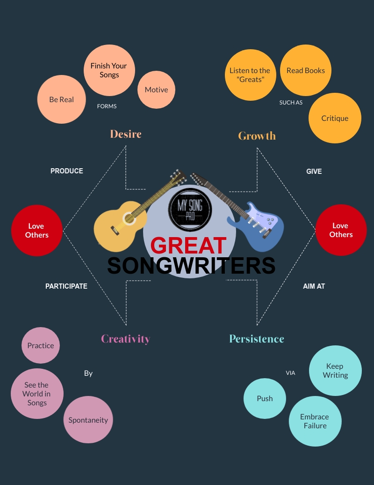

*How do I develop a songwriting routine?* **Build some habits that cultivate your creativity. 1. Making up melodies. This is as important as writing lyrics. 2. Big toolbox. Learn the tricks and skills that help you the most. 3. Set time. Punch the clock just like work. 4. Record everything, then weed. Save all your "spontaneous ideas" and review them at a later date. 5. Repeat. Write again and again and again...**

Every "successful" songwriter thinks they have the secret sauce to "making it big". The truth is that all songwriters, whether they've made it or not, work differently.

That's one reason why finding any help on songwriting can be elusive. You're likely to get a thousand different pieces of advice because every "successful" writer thinks their routine is the best way.

So why is what I'm going to share any different? Because **my goal is to help you become the best you can be** not necessarily the one who sells the most records.

You see, most writers who haven't "made it" are under the impression that all it takes to "make it" is to sell a great song. Wrong.

That is only one part of it. Let's see, there's production, promotion, performances, networking, etc. I could write an entire post on just networking.

A huge element to "making it" in the music industry is "who you know". We've all heard the stories about artists that "made it" because another famous artist heard them perform. 

It happens more than you realize. Why do you think so many people move to Nashville, LA, or NY? They are going where they are likely to get the most attention.

I'm only scratching the surface of this thing here. There are as many strategies on how to "get discovered" as there are on how to write great songs. Possibly more.

So before we get off into a quagmire, let's hit the re-boot button. **I want you to forget all that stuff about how to "make it" in the music industry.** We need to focus on your songwriting craft.

And before you start arguing with me in your head let me explain why. The most important thing about songwriting is writing songs. "Duh!" you say? That's right, "Duh!"

> Developing a routine will help you avoid "burn out" and "the wall"

If you aren't careful you'll get your cart before your horse here. Here's what I mean by that. If you "make it" before you've arrived as a writer you may bomb because you can't re-make any great songs.

You'll be dubbed the "one-hit wonder". You don't want that. "Has-beens" have just as hard a time being taken seriously as "newbies". I don't want you to "get lucky" at songwriting.

I want to help turn you into a song machine. **I want you to spit out one song after another because it's part of who you are.** Whether you “make it” or not is immaterial.

If you don't have a love for your craft and a well-rounded routine, you will likely get burned out. The inspiration that might have helped you write that "one-hit wonder" is not guaranteed to strike twice.

I want you to be the next Hank Williams, Dolly, Loretta or whatever writer you consider to be awesome. If you get to the end of your life and have one thousand songs that never made, then I've done my job by you.

**Developing a routine will help you avoid "burn out" and "the wall".** This is a crucial thing for you to do if you want to become a life-long great songwriter. Let's get started.

## **Step 1. Making melody**

**We were made to make music.** God has sewn music into the fabric of every human being. That's why we love it so much. You may have noticed there are some of us with an extra dose of it.

Take John Williams for instance. Arguably one of the greatest composers of all time. I mean, how many movies has he written music for where the music "made" the movie?

Music is powerful there's no debating it. So how can you make more of it? Make it up. Hum. Sing. Snap your fingers. No matter how foolish you feel, give it a shot.

You'll be surprised at what will come out of you. Will it all be catchy number one hits? Not likely, but that isn't the point. **The reason great songwriters can write on a dime is that they practice.**

That's right. They may not call it that because the word "practice" carries a little bit of a negative tone depending on "what" you're practicing. Even if humming seems like work, do it.

The more you do it the more you will enjoy it. Especially, when you see the fruits of your labor. Eventually, a melody is going to come out of you that you just can't stop humming.

Don't get discouraged if you go for a few days or weeks without having something that you want to develop further. **You will find that things tend to come in waves.** I'll touch on that more a little later.

For now, think about ways you can integrate "making melody" into your life daily. It doesn't matter where or how as long as you are doing this consistently. Here are a few ideas:

* Turn the radio off while you're driving and whistle.
* Hum while you are doing chores.
* Sing while you're on the toilet.

**Developing great melodies is as important as lyrics.**I've said it before. A great melody can outpace the dumbest lyrics. This is a powerful habit to build into your everyday routine.

Before I move on, I want to tell you another great way to help with developing melodies. **Learn an instrument.**If you don't already play, then learn.

Now look, don't go trying to learn the Oboe. **I would start with the guitar or piano.** Those are the two best accompaniment instruments for writers, in my opinion.

They aren't terribly difficult to learn either. You just need a few basics in beginners music theory and timing. If I had to recommend one or the other, I would pick the guitar.

Simply because of a little invention called a "capo". That little booger will allow you to play just about any song you can think of while only knowing a few simple chords.

I do all of the above concerning making melody, but my favorite is my jam sessions. I can't tell you how many melodies have come from just sitting and playing my guitar.

**Learning an instrument is like "Popeye's spinach" for a songwriter.** As your playing gets better so will your writing. I highly advise you to do this if you haven't done it already. Alright, let's get on with it.

## **Step 2. Giant toolbox**

I suspect this is the one that you've been waiting for. As much as I focus on developing your own approach to songwriting, we do need to examine what others do so we have something to go off of.

I don't want you trying to re-invent the wheel. Let's just paint it a different color. There are plenty of good "exercises" you can do to try and encourage creativity.

That's really all we want to do. We want to get our creativity muscles to respond on command if we can. The best way to do that, again, is practice.

Now look, I'm not going to recommend anything that looks like worshiping the devil. So if that's your thing then these may not be for you.

These are for people who want to write great songs but don't want to sell their souls. All we want to learn is how to work out our brains which means you have to have brains to qualify.

### **So here are a few things that other people do, including me, to help get "the juices" flowing:**

* **Meditation**

Thinking is good exercise for the brain. Now, don't go find a mountain in Tibet to sit on for six months. I also don't want you "completely emptying" your mind.

Another term for meditation is "focus". I want you to concentrate on creating melodies, lyrics, structure, or any component of writing a song you want to work on.

This can change each time you do this. It doesn't have to only include creating new songs. The point is to focus on one thing at a time. For instance, I recently had a syllable problem with a song.

I couldn't find time to sit down and work on it at home so I did it at work. Throughout the day as I hit familiar tasks or breaks I would meditate on my writing. 

By the end of the day, my problem was solved. All I needed to do was come home and play through it a few times to commit it to memory and record it.

* **Quotes**

All a person has to do is listen to the lyrics of the songs they like to find how valuable this skill is. Memorize quotes. Read quotes regularly.

This will change your writing and it's fun. There are several sites online that have tons of quotes on them. One of my favorites is "brainyquote".

https://www.brainyquote.com/

The point of a quote is to use or create a catchy phrase that you can use as your lyrics. That quote or phrase needs to embody the theme of your song.

Some quotes can be a little too wordy to use as a chorus or a verse. In those cases, I simply boil the quote down to another quote by summarizing that was said in my own words.

* **Dictionary**

Learning the meanings of the words you are using may sound like a stupid suggestion but you'd be surprised. "I don't think it meansa' what you think it means!"

In some cases, you may find the "definition" inspirational. Jack Johnson's "Flake" is one of the best examples of dictionary writing I know.

He literally found a way to define the word "flake" by using human behaviors as an example in his lyrics. He more cleverly did this without ever using the word "flake" in the song.

We have an enormous language full of words that we have probably never considered using in a song. Reading a dictionary is a great exercise for expanding your vocabulary.

* **ERV (ending rhyme variation)**

This is a huge subject and I spent a lot of time on this in another article "5 exercises that will make you awesome". I will give you a condensed version here.

Essentially, you want to take words that you know  and walk through the alphabet rhyming as you go. Start with words that are a perfect match then expand out to vowel sounds.

For instance, you may start with crazy, daisy, hazy, etc. Start at "A" and go to "Z" if you can. I've seen this called "poor man's rhyming dictionary" before.

Next, I want you to play with the ending vowel sound of the words and see if you can "re-shape" them. Then walk back through the alphabet again with the new ending vowel.

For instance, baby and crazy (Long E). Now try baby and crazy (Long A). Aah, that's different. That trick can be used to rhyme words that aren't so obvious.

* **Time drills**

Some people work really good under pressure. If that's you then use a timer. There are specific drills you can do that will help make you faster and better.

One is to see how many song titles you can pump out in one minute. Write as fast and vigorously as you. The key is no hesitation. If it pops in your head write it out.

This can be done with verses or choruses as well. You can also time yourself on writing the entire song. See if you can finish the thing in twenty minutes or less.

Now look, this skill will succeed or fail based on your command of the English language so do the others I mentioned as well.

Also, I would warn you not to make this the way you write all your songs. This should simply be an exercise you include in your routine to work out your brain's creative muscles.

* **Puzzles**

It is a scientifically proven fact that puzzles exercise the brain. Sudoku is my favorite. I like numbers and math. That may not be your cup of tea.

I've seen some people use crossword puzzles. That's a great way to expand your vocabulary as well. Any puzzle that really tests your thinking.

Puzzle books and games are everywhere so it shouldn't be difficult for you to find something that fits your preference. Work this into your regular routine.

Something else that's related but not exactly puzzles are "mad gabs". What's great about these is that you get to hear words used in odd places. Not only will you get a good laugh, but you might also just get a new idea for a song.

* **Songwriter testimonials**

Hearing the "story behind the song" inspires me to write every time. One great way to hear the stories behind the songs is to form a troupe.

Having a group of writers you meet with regularly will help keep you creative and accountable. I can not stress the importance of this one enough.

You could be missing out on tons of great ideas and inspiration if you have become a "lone wolf" writer. We are always better together then we are apart.

Another way to hear testimonials is to watch songwriter panels or specials. You can find them on YouTube. Sometimes your local public broadcasting station will have them on.

Try this out and see if you aren't forcing yourself to finish watching because you're busting at the seams to write. Community is a powerful ally to creativity.

* **Parody**

This is one of my favorites. I love parody. Personally, I think it takes more skill and mastery of the English language to do parody than to write an original.

I'll probably get hung by toes for saying that. Think about it though. To completely deconstruct another person's song and put it back together in a way that's cohesive and funny takes extreme skill.

Some would argue half the battle is done for you because the melody is already there and I would agree. However, the half that's done for you is made for by the difficulty of finding a good theme.

I'm not defending my position just because this is one of my personal exercises either. It really is a great way to stretch your creative muscles and get them to work in ways you hadn't thought of.

Make a parody out of any song you like. Make it as funny as you can. Using puns is probably the best way to get started if you are new to the idea. This will help get your juices going.

If you aren't belly laughing by the end of it I would be surprised. The humor also makes this a good way to take a breather from writing if you have hit "the wall". Give it a try.

* **Inverted Parody (Melody)**

Now, this is an interesting exercise. I stumbled onto this while doing parody and have since made it a regular exercise. It's not very easy to do.

So instead of replacing the lyrics, lay them over a different piece of music. Try singing one of your favorite songs to the tune of "Mary had a little lamb".

Now, that's not a hard and fast rule. "Mary had a little lamb" won't work for everything. In those cases, try something else. Reverse it.

Sing "Mary had a little lamb" to the tune of "Thunderstruck" by AC/DC. See if you can make your voice sound like Brian Johnson when you do it.

This one should have you laughing even harder than parody. What you are training your brain to do is be more creative with melodies.

I told you before. Melody is as important as lyrics. This exercise will work out that muscle. Don't knock it till you try it. You may be surprised how hard this can be.

## **Step 3. Timing is everything**

I've given you a lot of skills to work on developing but none of them do you any good if you don't ever go to the gym. You have to set a time to workout.

Setting a schedule isn't rocket science. **Simply set aside some time and guard it.** It doesn't matter if you don't write a single word the whole time either.

What matters is that you make the rest of your schedule behave by respecting the time you set aside to write. No invaders and no excuses. Do it.

Some people are more disciplined than others when it comes to setting a schedule for themselves. That doesn't mean you get a copout because you struggle with this.

Following a schedule is a discipline that can be developed the same as any other skill. No different than your songwriting exercises. The more you do this the better you will get.

**Great writers make themselves write even when they don't feel inspired.** Inspiration can be a very fickle thing anyway. You have to build a habit of working even when you don't want to.

Even doing something you love for a living will be work sometimes. Your best will not be the same every day but bring your best every day and you will rest easy at night knowing you gave it all you had.

**At the very end of the day, we make time for the things we want to make time for.**Therefore, I can not help you much further with this step. When you're ready to get serious about being a great songwriter you will do this.

## **Step 4. Record everything**

I don't care how dorky you think the idea is, record it. Music is extremely subjective. How you feel about your song now may change later.

If you've done what I suggest and have gotten yourself a troupe to hang out with, let them be your feedback panel. **Don't trash and idea simply because you don't like it.**

What I have learned over the years is to be neutral about my work. If not, you're gonna fall in love with certain songs you've written that nobody wants to hear and dread the ones that they request.

There's nothing wrong with having favorites or preferences. Just don't let it guide your thinking and stifle your creativity. **Balance is the key.**

I encourage all young budding songwriters to find their identity early on and stick to it. That doesn't mean blocking out ideas that may be a little different than your normal writing style.

Those random spurts could be an opportunity to collaborate with someone who is at home in that particular genre.

**Recording your ideas is not the same as developing your ideas.** There may be a time in the future that you want to go down that road but it doesn't have to be at the very moment you were inspired.

If you aren't careful those all those random ideas can come flooding in a ruin an otherwise good song. Some suggest blocking them out. I record them.

I have actually spent entire "sessions" recording song ideas. It can be frustrating when this happens but it's always turned out to be for the best.

**Learn to be more neutral and record your ideas.** You never know, those random ideas may help you finish other ideas that you have been stuck on.

## **Step 5. Repeat the process**

In conclusion, repetition, repetition, repetition. The more you do these things the better you will get, the more natural it will feel, and the easier you will find it to do.

I think "improv" is a very impressive skill. "Who's line is it anyway?" has always been one of my favorite shows in this regard. I have tremendous respect for being able to create on the spot.

It takes time, discipline, and learning to be able to get to where you can "spit it out" under pressure. These guys are awesome because they've done it over and over again.

They been in the trenches of being "stuck" and pushed through it to become a master of their craft. Similarly, I've met many great songwriters who used to get frustrated with being stuck.

They kept going. Kept learning until they became a master of their craft. Are they done learning? Never. None of us are. We can all be better.

The way to get better is to keep pushing. Keep writing. If you write a piece of crap, hang on. A great song is just around the corner. Keep writing.

If you just wrote a great song, hang on. A piece of crap is around the corner. **The key is to keep writing.**You also need to change the way you view your writing.

Don't see your song portfolio as a series of successes and failures but rather the story of your life and growth as a writer. One big learning experience.

What others would call your failures were merely opportunities for you to learn. What some would call successes were merely an opportunity for you to learn.

As you learn, write. As you grow, write. Are you getting the point? **You are your own "secret sauce"**. You just need to write down the recipe for the rest of us to learn. Now go write it!