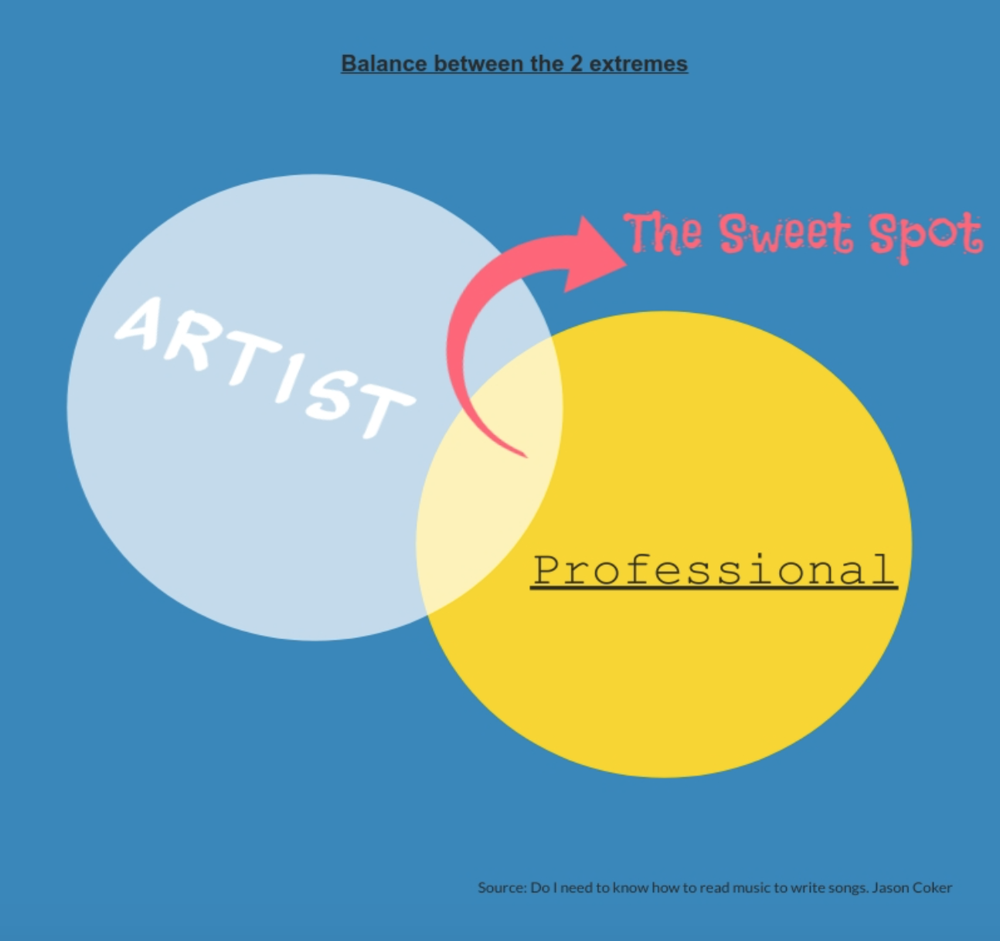

*Do I need to know how to read music to write songs?* **No. You don't need to know how to read music to write songs. All you need is a couple basic skills. #1 Song structure, pattern, or format. This is simply how the song is put together. #2 Melody. This is how the song goes or is sung. You can do this by simply humming to yourself. Reading music isn’t necessary for either one of these.**

## **The basics of songwriting**

All you need to know is a few basic things about song structure and melody. Now, don't let your brain fall out. I'm not talking about music theory.

Have you ever caught yourself humming something that you made up in your head? Well, you are a songwriter. Don't fall into the trap of qualification. This is a man-made device to segregate.

God creates us in his image which blesses us with the desire and ability to **be creative**. Don't let some arrogant jerk who thinks they are God's gift to music convince you otherwise.

If you weren't qualified in some way to write what is in your heart then you wouldn't even be reading this would you? The song inside you is trying to find a way out.

Once I give you these few basic things to keep in your head you may find yourself sitting with a piece of paper holding onto your pencil **for dear life** because it seems to have a mind of its own.

We all long to be heard and last time I checked we all have a voice. Express yourself in the most genuine way you can and keep it simple. The best songs are always the most basic songs.

So, **unless** you intend on composing a concerto in C minor for a full orchestra, theory isn't really necessary. Now somebody is gonna disagree with me on this and that's fine.

They are allowed to be wrong. I will settle it by wagering that there are more well-known songs written by those who do not know theory than there are who do. With that said, let's move on.

## **Structure, pattern, and format**

Let's start with the structure. Without a good foundation, a house will not stand. No different than your own house. The structure is what keeps things from falling apart.

Another term for song structure would be a **pattern or format.** This is simply the order of verses, choruses, bridges, tags, etc that make up a song.

There are a few basic structures you can start with but it can be as customized as you would like it to be. Having said that, it might be a good idea to **learn from others** what works and what doesn't.

Take "Happy Birthday" for instance. This is quite possibly the most popular song ever written. It's literally one chorus. Wouldn't you love to have written that song?

Structure, pattern, or format is part of what makes the song yours. Sometime the structure you start with won't be where you end up. I've had verses become choruses and visa versa.

At the end of the day, you want the structure that best suits the message you want to communicate to the audience. You might try several different patterns before you settle on something.

I have even brought in someone else who writes **differently from me** to see what their spin on my song sounds like. You may just like their version better.

Always **experiment with your stuff**. After all, you wrote it. I've gone back countless times and updated or changed songs based on new things or techniques I've learned.

That is one of my favorite things about songwriting. It is a never-ending work of art. It can morph and change as many times as I need it to. Just think about some of the really old songs that have been "re-done".

So, start by listening to your favorite music to get an idea of song structure and then start creating your own. Tweak and adjust until you have something that you enjoy.

## **The melody you hear in your head**

Now, this is the thing that is like catching lightning in a bottle. A good melody is sought after by even the most successful songwriters. It's the thing that eludes us and drives us nuts.

Because we know that a good melody can outpace even the dumbest lyrics. "Come on Barbie let's go party" Seriously? But man was that a popular song in its day, right?

I want to be careful because I might offend someone by calling their favorite song stupid. Music is so subjective in that way. What may be a great melody to you might sound dorky to the next person.

I would say that there are really **three schools of thought** on melody. Those who say it's crucial, those who say it's not, and those in the middle.

1. Those who say it's crucial are gonna be people who either make a living writing or want to make a living writing. They won't be artists but professionals.
2. Then you will have the ones who argue that everything is an expression of art. They could care less about how catchy the melody is because they achieved zen while writing.

   *Being in either one of these extremes makes you nearly impossible to work with because no matter which one you are nothing is ever good enough*
3. I prefer the middle ground. This is where creativity thrives I believe. Somewhere between being an artist and a professional. We all want to pay the bills but we want to love what we do as well, right?

**So what I do** to achieve this balance is to play with new melodies constantly in my head. I may even take familiar lyrics and try to make up a new tune using those lyrics. Once I've got something I like, I replace the lyrics.

One of my favorite tools for keeping track of my melody ideas is my voice recorder app on my phone. It doesn't have to be complicated. The trick is not to forget a good idea.

Melody creation is something I do every day if I can. Like I mentioned early about humming. Do it more and more. Same as writing. Be as creative as your mind will allow you to be.

Now the way I keep my inner art geek in check is by weeding out all of the cheesy stuff. You can do this is several different ways that are pretty effective.

You can run your ideas by someone you trust for starters. Now don't pick someone who is tone-deaf and has no taste. That's not gonna do any good.

Pick the most critical person you know and someone who isn't so critical. The feedback from those two including your own opinion should be enough to decide whether you want to spend time developing an idea.

There is nothing new under the sun so there has got to be something out there that is like what you are trying to achieve. Listen and be extremely critical. See if it helps you find the flaws in your own writing.

## **Finally but not finality**

There are a thousand different ways to write. Every piece of music you have ever heard has two basic things. Structure and melody. Anytime you get discouraged about your skill, remember Beethoven.

Beethoven wrote some of his best music while he was deaf. What does that prove? It proves that the desire to create comes from within us and was put there not by teaching but by God.

Make it what you want it to be. Notes on a page only convey to someone else how to replay what you have lived. Without you living it and writing it those notes wouldn't exist.

And don't worry, there are tons of technologies out there to help wayward souls like us who don't read music. Programs that will literally write sheet music as you play the melody.

There are also people out there like me who will help you with your structure. Don't be afraid of it. It isn't rocket science. **Check your motive as well.**

Being on one extreme or the other of those three mindsets I told you about earlier will get you superficial results. Find the balance to make it fun.

Don't let anyone tell you that you must be qualified to use your gift. It's your gift and therefore yours to express. All you've learned how to do is to do it in a way that people will enjoy it and share it.

All of us have a story to tell and for some of us, the best way to tell it is in a song. The beautiful thing about your song is that it's your song. Now go write it.