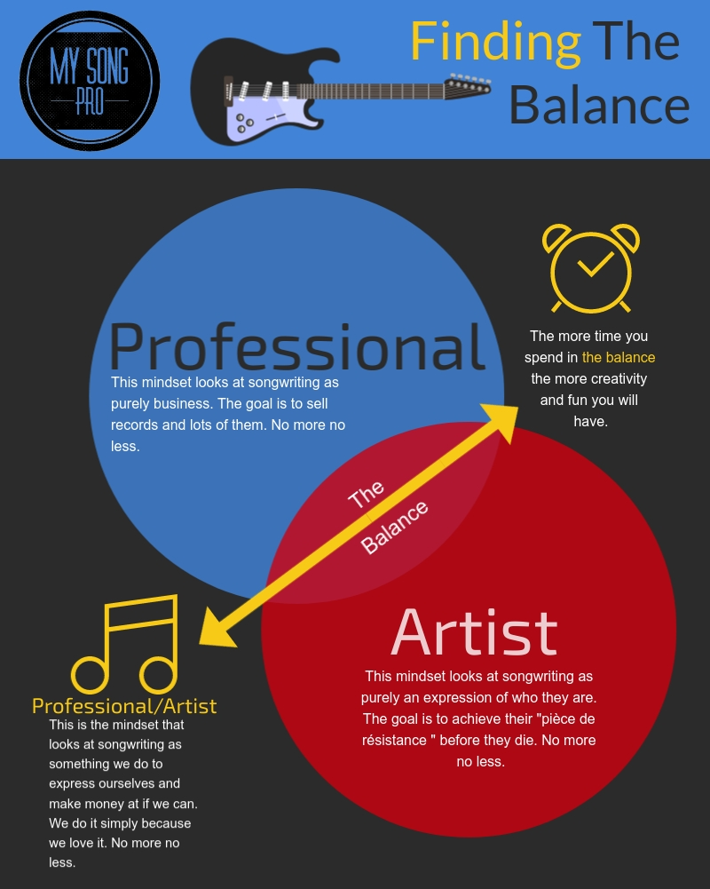

*When should I stop using guitar tabs?* **Uh, Never. Unless they are hurting you're learning. 1. Tabs equal community. Tabs are the next best thing to a collective jam session. 2. Treasure map. Tabs will get you going in the right direction. 3. Buried treasure. Tabs will help you learn new techniques. 4. Recognition. Tabs will help you develop your ear. 5. Creativity. Tabs will help you write your own music. 6. Teacher. Tabs will allow you to teach someone else.**

## **"No more Tabs. Just more Tears"**

Stop using tabs forever? Uh, no. What a notion! I've been playing a very long time and I know guys who have played longer than me that still use tabs form time to time. I already know your next question. "Are they any good?"

Oh yeah! They don't use tabs because they suck. Well, the tabs might suck but they certainly don't suck as players. They use tabs because it saves time and energy trying to figure something out from scratch.

Besides, most of the time they're trying to figure out something complicated like some crazy Van Halen riff or Joe Satriani solo. The point is that you never get too old to learn from someone else.

Nine times out of ten, these guys I know will learn the part they are endeavoring to figure out and then turn and help the guy who wrote the tabs fix the things that weren't completely correct. Result? Everybody learns something.

Anyone who thinks that they are beyond learning isn't someone I want teaching me or my students because I know they've got a limit on their knowledge.**I want a teacher who's not only ahead of me but stays ahead of me by constantly learning.**

I think that's a lot better way to approach tabs. **The whole purpose behind tablature and the reason it's so popular is that it's a super-helpful tool.** I mean let's face it, tabs are everywhere because of that.

Now, here is the caveat. If you are not getting better at playing because you are relying on tabs as the "gospel truth" then you need some perspective. Tabs aren't perfect because people aren't perfect.

Some occasionally get things dead-on but in most cases, there is likely something a little askew. If you turn a blind eye to this then you will essentially be picking up someone else's bad habits without knowing it.

Some folks are shouting, "Amen!" right now while others are shrugging their shoulders saying, "Who cares?" I say it doesn't have to be one extreme or the other. There can be a balance. We don't have to throw the baby out with the bathwater.

You "purest" who hate tabs need to understand that tabs aren't going anywhere. For those who are now shouting, "Amen!" you need to make sure tabs aren't holding you back. **We should always be endeavoring to learn everything we can from tabs.** Including how not to play.

I've been around music, teaching, and songwriting a really long time now and I've noticed in my career that all musicians fall into basically one of these **three** different types of people:

1. **Artists** - everything is about trying to achieve "zen" when they are creating. These are the people who drive you nuts with the terrible songs that they are convinced are the greatest things ever because they had an "enlightening" experience while writing them. "Money is the devil. Music is art! The two don't mix", is their motto.
2. **Professionals** - everything is all about perfection and the science of being able to make money at what they do. If they aren't making money then they think they aren't good enough to make money. "Nobody ever got paid well for sloppy work!", is their motto.
3. **Professional/Artists**- Everything is about having fun and learning new ways to get better. They are going to play and create no matter what because they love it so much. If they can make money at it great. "I'm gonna get so good at having fun that people pay me for it", is their motto.

I want to show you how you can find the balance to be both a professional and an artist. If you will learn from me, you will be able to use tabs to become not only a better player but a better listener as well. Eventually, you will be teaching those right where you are now.

So I've broken this down into three stages of development. This method isn't written in stone but hopefully, it will help you wrap your mind around how to use tabs wisely to become the best musician and writer you can be. Let's go.

Before we move, I want you to know about a **FREE** download that’s available to you in this post. I have put together a **FREE TABLATURE SHEET** for you. You can down load it as many times as you want and use it as you please. **100% FREE** when you sign up for our newsletter.

### **Song Pro’s Tablature Sheet**

### **6 string guitar**

<a href="../img/tabs.pdf" download="../img/tabs.pdf">(free downloadable PDF click here)</a>

Alright. On with the show...

## **STAGE 1**

### **Tabs are for jamming out**

We all want people that we can jam with, right? It's one of the best ways to learn. When you don't have people to play with, **tabs are the closest you're going to get to a good jam session**.

And that is essentially what you are getting with tablature. You are accessing an entire community of players who are showing you how to play something they have "figured out" how to play.

A community of players that is "self-regulated" which can help you just like a jam session with advanced players can. You just have to learn how to get everything you can from the tabs you are using.

What you don't want to do is to fool yourself into thinking that you are done learning once you've figured out a certain tablature. We don't want to get lazy and always expect someone else to be helping us figure things out. 

If you're just trying to learn something to impress your buddies, then I say "No harm. No foul". However, if you are a serious player, please don't stop at tabs. **There is so much more to learn than just the lick.**

Look, I know tabs are imperfect. That's ok. They will give you a general idea. We will talk about that in a minute. Point is, you get close enough to get excited about playing. **That excitement keeps you open to learning new things.**

Think about it. We've all heard somebody playing a lick at Guitar Center and thought to ourselves, "I want to learn that. that sounds cool." So we rush home and fire up the computer to pull the tabs down off the internet.

Before long you've memorized the lick enough to work on smoothing out the rough spots. Next thing you know, you've got the amp turned wide open jamming out. Who knew learning could be so much fun?

Next, you go back to GC and stroll in smiling like a Cheshire cat looking for your favorite guitar so you can show off your new skill. Then your bubble gets popped when one of the kids who work there walks up and shows you the "right" way to play it.

Embarrassing? Oh, "that never happened to me", you say? So it's just me out here. I'm the only person who's done this? Somehow I don't believe that. I still see some of you doing this from time to time when I visit GC.

There was never a reason to be embarrassed. You know why? Because you learn something in both instances. First from tabs and then from the one on one tutoring from a better player. It's all about perspective.**If you can be open and humble you can learn a lot.**

As for the mistakes that you run into with tabs, there is an entire area on most sites devoted to the opinion of folks just like you and me. If you see something you disagree with, let the tab writer know. Trust me, there are plenty of people doing that very thing as we speak.

### **Tabs have hidden treasure**

Have you ever seen "The Count of Monte Cristo"? Caviezel's got this map to the treasure of Sparta. The problem is that the map doesn't have an "X" which marks the spot. It's a bunch of clues he has to figure out to get to the treasure.

As stupid as this may sound, tabs are much the same.Why would you sit down and slowly work through trying to figure out a song purely by ear when you already have online access to the clues on how to play it?

Duh! I'm going to get the clues. Why? Time. I don't want to spend a ton of time trying to figure out each and every finger placement and technique by ear. Especially, if I can look at a sheet of clues that will get me close.

Now, this is where some of you may stop. You've downloaded the tab or checked it out on "Ultimate Guitar Tab" and you've worked out roughly how to play it. That's awesome. **I love it when players teach and learn from each other.**

However, you can't stop here. You have to make sure what you are playing is the real deal. Fortunately, that's a pretty simple thing to figure out. **Just play along with the actual song.** Any variations are gonna pop out to you pretty quick.

What you are trying to accomplish by cross-referencing the tabs with the music is to train your ear to hear the individual parts in the mix. That's no mean feat if you do it from scratch. Aah! We had the treasure map to point us in the right direction, didn't we?

Now, I will say I've seen students take to this like a fish in the water while others took months to get a grip on this skill. **My point is that everyone learns at a different pace.** So don't be too hard on yourself if it takes you a while to get the hang of matching your playing to the recorded version.

I believe this is one of the reasons some folks get stuck in the rat wheel of only using tabs. In some cases, it's very difficult for them to hear the guitar part in the mix well enough to figure it out.

If that is you, let me tell you that if I can learn how to do it so can you. I got trapped in the rat wheel of tabs as a young player myself and it took time for me to get off. What helped me is exactly what I am telling you. Listen to the song and play along with it.

**One other great tool is YouTube.** Not only do you have the benefit of seeing the person who's teaching you but you can also hear them as they played. Try pairing up your tabs with a good YouTube vid and see if you can't smooth out the rough spots.

You have to learn to crawl before you learn to walk. This is one of the very reasons I still point people towards using tabs in the early stages of development as a player.

It's simply an awesome way to practice.

Dissecting songs is a much easier concept to absorb if you don't have to eat the entire elephant all at once. **Tabs are a great place to start.** Half the work is done for you. Learn the song one bit at a time. Just don't stop there.

## **STAGE 2**

### **X marks the spot**

Now for the cool part! **My absolute favorite part of learning other people's music has always been "technique".**Some "purest" will preach that you need to learn a song "all the way through". I say Nah.

Now look, if you play in a "cover band" then yes you need to learn the whole song in its "purest" sense. However, that's the exception. I doubt the rest of us are going to be allowed to play "eruption" in front of ten thousand people anytime soon.

Therefore, I don't think it's necessary nor does it dishonor Eddy if you don't have the entire thing memorized. I mean I don't know about you but I didn't become a player just to learn other people's songs.

Again, we don't want to reject the idea of tabs and learning from others altogether. That will stump our growth. What we need to understand is "what" to learn from others. You need to pursue learning the technique. **The snare of tabs is learning the tune over the technique.**

Most players that stop at simply learning the tab are generally caught up on just learning the tune of the song. Either to impress their buddies or to try and show off at GC. It's always cool to learn a new tune but did you learn the technique?

Only learning the tune is like Caviezel getting to the place where the treasure was buried and then saying, "I'm not getting in that water! That's too much like work. I had fun. I'm good." That's just stupid.

The treasure is right there in front of you dude! What are you doing? Slides, hammer-ons, bends, harmonics. Holy crap! The list goes on and on. **Learning other people's music needs to be about learning the techniques they used in their songs.**

I've been playing 25 years and the list of other people's songs that I can play "all the way through" is much lower than the number of techniques I learned from those songs. The technique is the treasure here.

Don't get me wrong. It's a blast to crank up the amp and play "Sweet Home Alabama". It's one of my favorite tunes. More importantly, it's one of the best songs to learn the technique of hammer-ons. There are a few other gems hidden in that song but you're gonna have to go find them.

Sometimes if you are fortunate enough the tab writer will have the correct techniques in the tablature. But that doesn't really matter much. **I think imperfect tabs are better for you anyway.** I just heard someone shout, "He's of the Devil!"

Look, those "mistakes" will force you to go learn the song if you will let them. I've seen it. Something else awesome is that the more you learn those techniques the easier it will be for you to hear them being used in other songs and spot mistakes in the tabs. **It's a skill that builds on itself.**

### **The wind-up and the pitch...**

So now we got our tabs out and the music playing as we are trying to smooth out this place where the tabs aren't correct. It's cool because we have done this enough to feel comfortable with now. Suddenly your brain shouts, "Wait! Stop the music. I've heard that sound before."

"Did you hear what he just did? Back it up. Where have I heard that before? I know that note. (plucking the guitar frantically) Ring, ring, ring. BINGO! I knew I heard that note before. I just played that the other day while I was making stuff up. Awesome!"

That was easy, huh? Ever happened to you before? What's going on is that your ear is being trained to hear certain sounds and notes that have become embedded in your memory. It's called **"pitch perception"**.

Your brain simply learns to interpret the notes that you are hearing as notes that you've heard before. That means that this skill can get better with time and practice. Don't let anybody fool you into thinking you have to be born with this. Yeah, uh not true.

The best way I know to teach this to you in this post is to think about tuning your guitar. When you are tuning your guitar by using your frets you are trying to match the notes to the other strings which are fretted. You've done this before I would assume.

For the old dogs, this concept is likely pretty boring I know. However, think about how your ear recognizes either when the string is out of tune or in proper tune. Over time your ear will hear when your guitar is out of tune because your ear has been trained to hear it.

**The absolute best way to train your ear is by doing exactly what I've been telling you to do.** Dissect other people's music to learn new techniques. As you do this your ear will learn what things should sound like. This is one of the other reasons I believe tabs are so powerful.

The learning curve to pitch perception with an instrument is knowing where the notes are on the fretboard. Just because you hear the note doesn't mean you know where your finger goes. This is where tabs come in. Tabs give you a layout of where exactly to place your fingers.

Something else I've seen people do is take stickers and put them all over their fretboards. Hey, whatever floats your boat dude. Whether it's stickers on the fretboard or tabs and tunes, time and practice are your best friend. Your ear has to be trained and training takes time. 

Another technique that helped me with pitch perception early on was **"melody mimicking"**. If you can hum, whistle, or sing this may work for you as well. What you do is simply hum the melody of the song you are learning and pick it out on the guitar.

Single notes on the fretboard will do. No chords just yet. **Figure out where the melody is and then play it over and over.** Once you've got it down, start looking for the chords that correspond to the melody.

What's happening is that your ear is dissecting the music and breaking it down. As you hum, your fingers are searching the board and plucking the notes while your ear is processing the sound to see if it matches. Try it and see if this works for you.

## **STAGE 3**

### **Check out my new riff dude!**

It just keeps getting better. Every new skill and technique you learn will spawn creativity and excitement in your playing. Hopefully, you are doing a little bit of writing yourself once you get to this stage.

And don't spaz out. You don't have to be able to read music to write music. If you want, you can start writing your own personal tablature. At this point, you've probably seen enough of it to give it a go anyway.

**[Check my article "Do I need to know how to read music to write songs?"](https://mysongpro.com/posts/do-i-need-to-know-how-to-read-music-to-write-songs/)**

If you're doing the things I'm teaching you here, then I know you can write your own tabs. Put those skills alongside recording your music on some type of device and you will be unstoppable.

**[My multi-track recorder "Br800"](https://www.amazon.com/BOSS-BR-800-Portable-Digital-Recorder/dp/B003IJ7BL6)**

Did you know that Joe Satriani's "Satch Boogie" came from years of putting together tapes he had recorded? Over the years he said he amassed like over three hundred of those tapes. He simply made one more that incorporated a lot of the techniques he had mastered.

If you have never heard Joe Satriani then you are missing a treat. Satch learned one technique at a time. He compiled all of his techniques over time to create some of the coolest music ever.

You can do this too.

All it takes is some effort in applying the techniques you've managed to pick up from the music you have learned. Try incorporating hammer-ons, slides, bends, or harmonics in one of your songs and see where that goes.

What's happened for me over the years is that with every new technique I picked up I wrote a song or a piece of music using that skill. It has been much the same for many of the other players I know.

I want it to be the same for you. **Creating your own music will be where you truly master all the techniques you learn.** If you only use them playing other people's songs, you'll never fully learn to use them.

If you aren't writing your own music, then start today. If you are writing your own music, keep going. The more you use the skills you are learning in your own music the better you will get. Who knows, we may be listening to your music on the radio next.

### **The master craftsman**

If you've been tracking, we started way back at the beginning with tablature and learning from some else how to play. Now you are the teacher. Chances are you've been teaching without knowing it.

As I've already told you, I used to be a Guitar Center wallflower. I would go to GC just to listen to other people's skills. Several times I was honored to be able to sit down with one of those guys and learn first hand.

But like I said, it was usually the kid that worked there who came over and helped me smooth out the riff I had just learned. Hey, no shame, right? As long as you're learning who cares about ego.

I truly hope that you will get to this place. Too many players learn the skills I have talked about and become so arrogant you can hardly stand to listen to them. If someone comes to you for help, they have already admitted that you are better. Don't rub it in their face.

I want you to have the heart of a teacher. "How good do you have to be to teach?" you ask. Good enough to teach, I say. What does that mean exactly? I'll explain.

If you know something I don't and you have the heart to teach it to me, then you are a teacher. Does that mean you know everything about everything? No. But you do know more than I do about this one thing so teach me.

**The best teachers teach what they know, know what they don't know, and strive to learn more than they do know.**Like I said earlier, chances are you're already doing this and don't know it.

If you've ever submitted a tab to a website for others to learn from, then you're a teacher. If you've ever jammed out at the guitar center with someone while showing them a riff you learned, you're a teacher. If you've ever sat down and pushed yourself to learn something hard, you are a teacher.

**A good teacher motivates you to want to learn more.** A bad teacher discourages growth. Those folks are threatened by people like you because you love to learn.They are already know-it-all so what is there for them to learn?

Know-it-alls have learned everything thing they will ever know until they learn they don't know everything. There is so much out there to learn so don't become a know-it-all and cap yourself off.

Go teach. Teach what? you say. **Teach what you know.** You will get even better as you teach it. No student expects his teachers to know everything. They just expect them to know a little more and be willing to share it with them.

I hope you understand why I am a big supporter of tabs and what can happen if you use them wisely. Don't throw the baby out with the bathwater. Look for the buried treasure and master the techniques you learn.

Create your own music and then go and teach someone else what you have learned. I hope to hear some of what you have written one day. **Now go write it!**