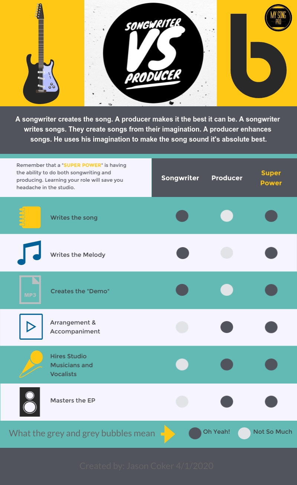

*Songwriter vs Producer -* **A songwriter creates the song. A producer makes it the best it can be. #1 A songwriter writes songs. They create songs from their imagination. #2 A producer enhances songs. He uses his imagination to make the song sound it's absolute best.**

# **The troubadour**

Songwriters are some of my very favorite people. you can never tell if they are listening to you or writing a new song in their head while you are telling them a story.

They seem to speak a different language. I've met songwriters that actually speak in lyrics. Everything is a quote to them. A boiled-down version of life events.

Their brain is never off or on standby. If they aren't firing on all cylinders then they are asleep. Some of us even dream of writing songs.

I personally had the weird experience of dreaming about a new song I had heard. I was listening to a favorite artist of mine sing it live in my dream.

At some point, I became lucid in my dream and realized this was an original song. I began re-writing some of the lyrics and melody in my head until it was finished.

When I woke up I had a fully completed song that I sat down and played for my wife. It was the weirdest experience I have ever had as a songwriter.

No, I wasn't on drugs for those of you who are thinking of Jim Morrison and The Doors right now. If you don't know this these guys use to get high on acid and go off into the desert to write songs. Yeah, weird.

Songwriters are weird folk which is intriguing and comforting to me. You have to be a little weird to interpret the world through songs. Or as I've said, "All of life is a song."

Songwriting is a rare gift and an extraordinary art form. It takes its place next to some of the greatest artists of all time including Leonardo and Michelangelo. Yeah, I said it.

Some might disagree pretty strongly maybe even a little offended by that comparison, but I bet Leo and Mikey's mama sang lullaby's to them when they were babies.

Somebody had to write those lullabies, didn't they? So there you go. Songwriting is one of the oldest forms of art and expression known to man. It dates all the way back to when God created us.

Seeing that God-given expression come out of a person is one of my most favorite things. The passion that surrounds the songs of a songwriter is enough to move you to tears sometimes.

I think that passion is what causes songwriters and producers to argue so much. The songwriter wants to preserve the "heart" of their song like a goose protecting its goslings.

Every time a careless producer gets near you will hear, "HISSSSSSS...." It's funny. I've done the same thing. We are all pretty protective and I'll tell you why.

That song is part of your life. When you get around somebody you feel is trying to use you to make money you feel like the "Dementors" from "Harry Potter" are trying to steal your soul.

Sometimes we just need to calm down. Not all producers out there are trying to destroy your work. They just want to help make it the best they can. The rub comes because we are scared.

If you can learn to take a deep breath and realize two heads are better than one you might be surprised. You gotta be willing to let someone add their interpretation to your song. I get it. That's tough.

But if you want other people to hear your music you may have to loosen your grip on your "baby". If not, the only option you have is to become your own producer and sometimes that works. Sometimes it doesn't.

# **Fresh produce or rotten produce**

A producer’s main function is to make it better. Maybe if we changed their names from producers to "make it betterers" the problems would go away. Probably not.

If a producer is not challenging what you think is the best way then they aren't doing their job correctly. You can always tell a bad producer by whether they agree with everything you are saying or not.

Good producers by nature can be a little arrogant. Mostly because they know what the audience wants to hear. They spend their entire careers looking at what sells versus what doesn't.

The great producers have had enough bad experiences to know exactly how to gage each performance in the studio. They are the bane of studio musicians.

You've laid down the best vocal of all time, the song will end, and the sound will fade out in the headphones. You will hear a very low hissing from the low electrical ground noise.

The studio button will click, **"........Do it again."**

"Grrrrr....I've done it ten times. That one was perfect," you shout at the glass.

The studio button clicks, **"........Do it again."**

While you are getting ready for your next take you can hear the faint sound of shouting. The songwriter and the producer are arguing again. Maybe they are arguing about your vocals. Who knows.

That is the nature of the beast when you are working together to make something special that will last for generations. The producer is striving for perfection and you just want it the way you wrote it.

A great producer is **not your enemy** though. He wants to make your song the one that touches millions of hearts just as you intended. He just knows how to get it done better than you do.

You have to learn to let go a little and let someone else contribute to what you have done. The big fear is that you will be eliminated from the equation.

Truth is that no one would even be standing in the studio if it weren't for the songwriters. Everyone would be out of a job. Everyone but the songwriting/producer that is.

## **The ultimate superpower**

I think the scene from "Wayne's World" describes it perfectly. "We're not worthy......we're not worthy." Holy cow these are some gifted people.

The ability to create structure, lyrics, melody, and music arrangement all in your head. Wow! It takes a truly gifted person to be able to do all of this. You gotta be a little bit of a freak too.

What's funny is that the more of these gifts you develop the less you need help in certain ways but that's ok because nobody wants to work with a freak like you anyways! I'm kidding.

As a songwriter, you need to thank God if you find someone like this. I mean seriously, get on your knees and thank Jesus. This person has been gifted by God to be able to help you develop your own craft.

They don't just speak in songs they speak in finished albums. They can hear all the instruments, the break stops, the mix, the vocal, the harmony, and the coffee machine down the hall in the studio just finishing its brew!

Seriously, these are cool folks. **They are your modern-day composers.** They may not be able to read or write sheet music but they can hear the entire orchestra in their head. Kinda like Mozart.

They say Mozart was a super freak. All he heard was music in his head his whole life. Everything was music to him. It's how he saw the world. It would have been awesome to watch him work, right?

I'm curious which one of these you are. Are you a songwriter, a producer, or both? Which do you hear more of in your head, songs or music? I bet you hear both.

It's time to take your gift to the next level, my friend. Nothing cultivates creativity like using your gift. Since you're a songwriter, make me something out of thin air and send it to me.

Go back and look at some of your old songs and see if it can be better. Imagine that new guitar part or piano part on top of your melody. **Can you hear the vocals?** You just became a producer.

Since you are now a songwriting/producer go make me an EP of your stuff. I want to hear what you have to say about your life and the world around you. God put that gift in you, use it.

I can hear it now. That song that you been wanting everyone to hear is begging to be sung. I'm waiting to hear it. I believe in you. Now go write it!