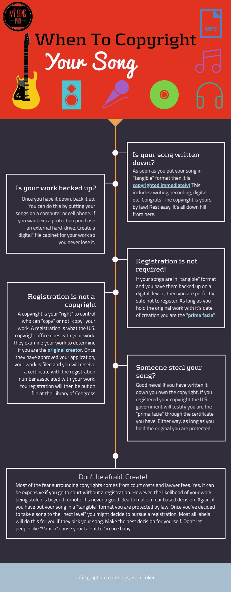

*When should I copyright my songs?*

**If you have written it down or recorded it, then it's already copyrighted!**

**1. Copyrights are immediate. As soon as you put it in a tangible format it's yours.**

**2. Copyrights are forever. As long as you hold the original and you can show proof of creation, it's yours.**

**3. Registration isn't required. A registration simply puts your copyright on file via the U.S. copyright office.**

**4. Registration defends your copyright. A copyright protects you by law, however, registration means the US government stands behind your copyright.**

**5. Copyright registration is cheap. Registration usually costs between $35-$65.**

**6. Registration can be "collective work". Several songs can be on the same Form PA as long as they are filed by the same writer or the same writing team.**

## **Protect your work**

Copyrighting your lyrics, melodies, finished songs, and ideas is as simple as pulling out your "memo" app or your "voice-recorder" app and making a record of them. **Everyone needs to do this!** Now!

You've heard the Geico commercial say, "It's so easy a caveman can do it!" Well, you have a little more to work with than "FIRE!" and "cave drawings".

I can't say this enough. Write it down. Record it. According to the U.S. copyright law of 1978, a "song" or "work" is automatically(immediately) protected as soon as it is created in a **“tangible”** form.

Now that you've done what I've told you and record everything, you need to calm down. **The "song-boogie" monster is not coming to steal your work.** I'm not sure where that whole narrative came from anyway.

The last time we had a major contest in court over "rights" was the recent events involving Napster, Lime-wire, Metallica, and other artists. However, that wasn't over who was the original creator.

That entire deal was about the artists not getting their royalties for music that was being downloaded and shared all over the internet by people who didn't want to pay to listen. That's call piracy and it has subsided a bit.

There are still idiots out there who pirate music but by and large, they aren't trying to prove they wrote your song. Nobody would believe them anyway. **You are super talented and they suck.**

And because you are super talented and have worked very hard to create your music, please record it in some format. **And because you are super smart you will listen to me.**You have no excuse for today's tech.

Computers, recording software, multi-track recorders, and even our phones have come a long way. If you couple that with some of the new "cloud" technology available, you really have no excuse not to do this.

When you record on any device now that file has timestamp data attached to it. This creates a record of when your work was originally brought to life.

You as the original creator now own the "rights" to that work and any "copying" has to be approved by you. Does that make sense to you? **That's why "it" is called a "copyright".**

It is immediate and it lasts as long as you own the original "tangible" format. This means you can pass it down to your children if you so choose. As long as they hold the original they own the copyright.

If you will cultivate the habits of writing things down and recording everything, you won't have to worry so much about your work being stolen by some random butt-pecker with a computer. Besides, it's a great way to remember how your song goes!

## **Registration is not copyrighting**

Ok. This is where all of the confusion over the years has come from, I believe. Let's start clearing it up. I'll give you my advice, as your teacher, later on down the line. **This whole thing isn't as complicated as some people have made it seem**.

There are so many songwriters out there that think as soon as they finish recording a "demo" of their new song that they have to fill out a "Form PA" (Performing Arts). These people are paranoid.

I don't mean that in a bad way. I just don't get it. Is your song even good enough to make money? If not, why would anybody steal it? Where I am going with this is that these paranoid writers are a little arrogant.

Just calm down, Charlie. Let's get some feedback and make sure people actually want to hear your song first before we worry about registering all of your copyrights. Breathe....in.....out....in.....moving on.

For those of you who aren't familiar with the term "registration", I'll explain it. The U.S. copyright office "registers" copyrights that are kept at the U.S. Library of Congress. The largest library in the world.

**"Register" simply means to put on file or to list a document on a ledger or a register.** It's no different than when you register to vote. If you vote, that is. You are requesting to be recognized as an eligible voter on a list of other eligible voters. 

The U.S. copyright law of 1978 has provisions which state that you can "register" your copyright with them and they will file it for you officially "recognizing" you as the original creator or in their words "prima facie".

You start the process by submitting an application, Form PA, which will require all your personal information plus a copy of your "tangible" work in one or more of the following formats:

* sheet music
* CD
* tape
* digital file
* other

Once your application is approved, which can take six months or longer in some cases, you will receive a certificate and a registration number that identifies you as the original creator or "prima facie".

This is a legal document that can not be contested in a court of law because it is backed by the United States Government. **This very powerful.**

Here is what is so significant about this document. In the event you go to court to prove you are the "prima facie", your official registration document represents that the U.S. govern validates your claims. Case closed. You win.

Now, if you go to court and you have NOT registered your work, then the burden of proof will be on you to provide the original "tangible" work with the "earliest" date of its creation.

In a case such as this, there is typically a ton of research and comparing documentation to verify who is actually the "prima facie" or the original creator. **This is time-consuming and costly.**

In some instances, a case where you don't have a registration could cost you more than **100k** in court costs and lawyer fees. The amount of $ depends on the amount of time involved. Now, don't let your brain fall out.

This is typically where people go nuts. Some people won't even share their work because of this paranoia. What they don't realize is that if they would share their work on YouTube or Facebook, for example, that put their work in a "tangible" form.

It would then be copyrighted by law! Remember? **A song or "work" is immediately copyrighted once it has been put in a "tangible" format.**I keep repeating myself because I want you to rest easy.

Song plagiarism is so very rare these days because of exactly what I've been describing. Our litigious society. Besides, if your song sucks, no one is going to take the chances of being sued to prove they wrote it.

If your song does happen to be good enough to be bought by a label or an artist then they will have "your song" registered in "your name" when the album is released. So again, no worries.

Don't believe me? Grab a CD or pull up and album online and open the little booklet with all the lyrics in it. Look at the top of the song. See the songwriter's name? "Aah, there it is right there. Who knew?"

People really need to chill out with this registration business. The managers and labels are not going to take any chances of being sued any more than any individual would. Especially, over bad songs.

Having said that, some of you will still want to register your copyrights because of the benefits. That's fine. Just don't do it because you are paranoid someone's gonna steal your "number one hit" song that nobody is listening to right now.

## **My opinion. Who needs to register?**

You may have the impression that I don't think registration is smart. On the contrary, I think it's very smart when it's done for the right reasons.

Unfortunately, a lot of songwriters get hung up on this without doing any research. Some will even talk themselves out of writing completely because they are afraid their work will get stolen. You're insane. Calm down.

I hope I have done a good job explaining this process thus far. It's not terribly complicated. You just have to stop taking legal advice from your drunk tone-deaf uncle.**Nobody's after you.**The "commies" aren't everywhere!

On the opposite end of the spectrum is those who go nuts registering everything they write as they write it. This is also a motive that is guided by fear. "How can you sleep at night knowing someone is trying to steal your unregistered music, man!?"

**If you are hoarding your work for fear, you are hurting yourself. If you aren't writing for fear, you are hurting yourself. If you are blowing the budget to register your work for fear, you are hurting yourself.**

We need to focus more on great writing and great writing habits than we do on registering copyrights. If you are writing it down and recording it then you are copyrighting as you go.

There are good reasons to register your work. Fear is not one of them. Like I said before if you do what I tell you and write it down it's already protected by U.S. copyright law.

I'm picking on some of you pretty hard because I want you to see how ridiculous some of this behavior is. Let's try writing something worth selling before we worry about protecting it.

Now, let's talk about three reasons I think it would be a good idea for you to register your work. You don't have to adhere to this advice. This is simply my opinion of what I would do if I were you.

### **1. You're an independent artist**

If you are one of these incredible people who do literally "everything", I would advise you to register. The reason is that you are touring, booking, writing, distributing, recording, etc.

Chances are you have already recorded an album or two that is on an independent label. It may even have your own studio. **Registering is as simple as sending in your finished album and paying the fee.**

An independent author copyrights their manuscript typically within 90 days of publishing a manuscript because their work is in circulation. I would recommend the same for your albums and EPs.

Especially, if you are touring a lot. Your music is getting a lot of exposure and you may even be selling a decent amount of it. Complete the loop by registering your work.

Plagiarism is rare and difficult in today's "tech-age", however, registration gives you that extra element of protection and will most likely be required if you need to draw royalty contracts for other contributing writers.

### **2. Registration is cheap**

I told you earlier that court costs and lawyer fees without registration can get into the 100k's of dollars. **Registration costs between $35-$65 depending on the application parameters and whether you file online or not.**

There is also a provision in the copyright law that allows you to file several of your songs at one time. It's called "collective work". This is great for songwriters and artists who have a lot of songs or albums.

Instead of filing for each song at $35 a pop, which gets expensive quick, you could fill out the "Form PA" as a "collective work" and include a full album's worth of music or more.

Some songwriters absolutely insist on filing their songs separately so they can have a registration number attached to each and every song. This is insane and unnecessary It's really a waste of money.

The "collective work" provision is the way to go if you have a lot of songs you want to register. The only restriction is the number of different writers you can have attached to different songs on the same "collective work".

Let me explain. If you are the sole writer of ALL the songs on the "collective work" that's fine. You can even have several writers or a team of writers on a single project or "collective work".

The problems arise when you have different writers collaborating on different songs in one "collective work". For argument's sake, let's say your "collective work" has 8 songs included in the application.

If Tom and Joe and you wrote all 8 songs together you're fine. However, we can't have Tom and Joe and you on 4 songs and just Tom and you without Joe on the other 4. The 4 songs that Tom and you did without Joe have to be filed as a "collective work" on a separate application or Form PA. Does that make sense? If it doesn't, re-read. I'm teasing.

**The costs for those individual applications are found on the [U.S. copyright office's website](https://www.copyright.gov/about/fees.html)**

**I recommend doing your registration through [U.S. copyright online registration](https://eco.copyright.gov/eService_enu/start.swe?SWECmd=Start&SWEHo=eco.copyright.gov)**

I will warn you that the terms on the U.S. copyright office's website can be a little muddy but with some persistence, you will have it down in no time. Besides, they will correct you if you are wrong, trust me.

When I submitted my registration application for my book it took **six months** (this is average) to get back. Mostly because of one error that I made which took six weeks to get smoothed out.

Yeah, if you're in a hurry then you are already late. The U.S. government doesn't get in a hurry. So I suggest if you feel you will need the registration for legal reasons soon, file yesterday! 

### **3. Is your song finished?**

I harp on this all the time. Some of you may be tired of hearing it. Well, you got two options. Get used to it or get over it. **Finish your songs.** An unfinished song is not a song, it's poetry.

If you record your "unfinished" ideas they are safe. So there are no worries about copyrighting. As you add to them to make them better, hopefully, you are going back to re-record them.

Each time you do that, you are "updating" your copyright to cover your "new" work. Again, copyrights are effective immediately upon being recorded in a "tangible" form.

Now look, I definitely would not recommend that you spend any money whatsoever registering "unfinished" songs. The registration registers the song "as is" at the time you submitted your application.

This means, that once your song is actually completed you will have to turn around and file a new registration to cover the "updated version".

You can't go back and amend a previously submitted registration. It doesn't work like that. If you file online the site will actually lock your documents and files once you hit "submit". "There's no going back now."

That's why registering is one of the very last things that publishers and record labels do before they release a book or album. **It becomes registered in the state in which it was submitted in or "as-is".**

Please don't spend money to register your unfinished songs. This is beyond paranoia. It's stupid. I can't see a circumstance where an unfinished song makes it to the top of the Billboard charts.

None of us should really be worried about people wanting to steal a bunch of half-baked songs anyway. Was that snarky? Yes, it was. I love you. Finish your songs. **Now go write!**

<iframe width="806" height="453" src="https://www.youtube.com/embed/seounxFTC1M" frameborder="0" allow="accelerometer; autoplay; encrypted-media; gyroscope; picture-in-picture" allowfullscreen></iframe> 