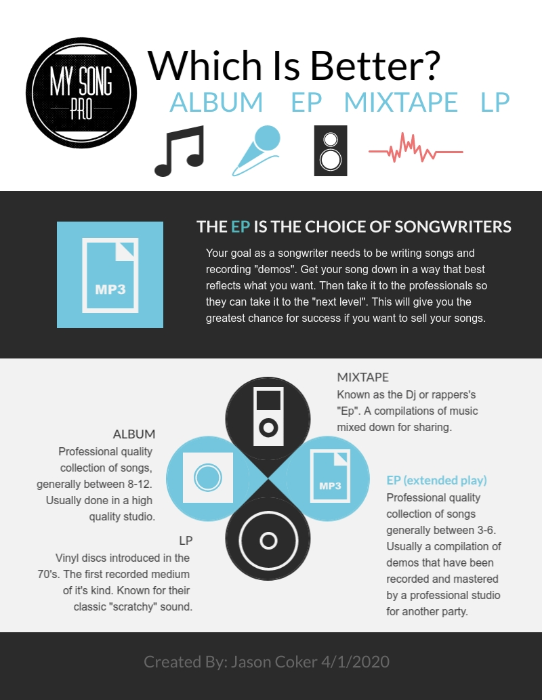

Album vs EP vs Mixtape vs LP. **An EP (extended play) is your choice for songwriting. 1. ALBUM = A finished recording including all accompaniment that's usually between 8-12 songs. 2. EP = In most respects like an album, however, it has only 3 to 6 songs that are a demo of your work. 3. MIXTAPE = Is a compilation of music typically dance, hip-hop, or electronic. Commonly known as the rapper's or Dj's demo. 4. LP = "Long play" or Vinyl records. These are the two-sided grooved discs that were the standard for years.**

## Once upon a time...

Oh, the golden years of albums and all the joys of having a collection to brag about. I remember my stack of CDs like it was yesterday.

I had dozens of albums. Some I didn't even care for that much. It was about the excitement of having that finished body of work in your hands.

Now we pull out our phones or worse a USB stick. Someone how it just isn't the same. Now don't get the impression that albums are dead and gone cause they aren't.

You used to be able to walk into an actual store that had nothing but albums as far as the eye could see. Some of you younger folks won't know what I'm talking about.

Ironically, the "music store" is where the younger generation use to hung out. Rows and rows of your favorite music with headphones every six feet so you could listen to your favorite artists before you bought their latest album.

You would slide those headphones on hoping you didn't get lice or catch a wif of teenage body odor and next thing you knew you were on stage with Metallica headbanging. It was awesome!

My favorite part of owning all my albums was having them on display. Some of you will remember that you would spend as much money sometimes on your display rack as you did your collection.

Then there were the stereo systems. Holy cow! This is a subject of its own. We used to have so many speakers just for listening to this little ole bitty CD. It was enough sound to vibrate the house off the foundation.

We were always limited by how long the speaker wire was though. If you wanted to hear my tunes my way you had to come to my place. Now we carry our music everywhere with us. Ironically the portable speakers keep getting bigger!

## "Dude, I own the boxset"

You can still find albums at places like Walmart but it's kinda like going to a war memorial now. I get a little nostalgic when on the rare occasion I come across an actual "music store".

The sound quality of those albums was great. Killer guitar riffs and drum solos. Blow your mind vocals. Producers and studio engineers were geniuses in their own right.

You would look down at the jewel case or vinyl cover and beam with pride because it was yours. You knew you held something special that took a lot of work to create.

Albums are kind of like a "Leonardo" painting in a way. They are the artists, producers, and engineer's work of art. Everything from the songs to the cover-art.

There is still just as much work that goes into that process today. It's just a shame that it isn't as prestigious to own the albums as it used to be.

My generation used to argue over who had the best version. Of course, when some who owned the boxset spoke up we all bowed and said, "We're not worthy."

I mean you had to love an artist's work to own every frickin song they have ever recorded. My little single couldn't compete against that.

These people are like the naked fat guys at football games who paint their entire body with the team colors and then jiggle when the camera comes by. A little gross but you gotta admit they're dedicated.

Albums will always command respect because of the work that goes into them to get them into your hands. I would say it's more labor-intensive than writing a book. I've done both so I can say that. Authors don't send me hate mail.

If you set out to record an album of your songs just remember that the bar is extremely high and rightfully so. Some of these artists, producers, and engineers spend months in a studio.

Perfection is an impossible goal to reach but it's what you should be shooting for. What you will get is the type of excellence that's expected by the audience.

## EP doesn't mean "electromagnetic pulse"

As a budding songwriter or as a seasoned veteran this is where you should camp out I think. My personal opinion is to leave the albums to the professionals and hone your craft as a writer.

If I had back all of the hours I have spent trying to duplicate the sounds coming out of those million-dollar studios I would have a thousand songs written.

A record is very time-intensive. That's why you can watch specials about the artist of yesterday basically living in the studio until their album was completed. Not days but months at a time.

I am not trying to discourage you from recording and album. You have to do your recording your way. Just make sure you have a reasonable bar set for yourself.

It's extremely easy to get sucked into trying to make your album sound "finished" and perfect because we all long to hear our stuff on one of these incredible albums we have come to love.

> The EP is your home base. 

You don't have to get crazy setting up a home studio either. I have recorded rough cuts with my phone and sometimes I still do. It depends on my schedule.

Not to mention, you are probably not going to be able to replicate the standard of quality from your home studio. I'm not saying it isn't possible. It's just very difficult.

There is a ton of equipment out there for home recording. Everything from handheld two track recorders to Cubase, ProTools, and $1000 Mackie studio monitors. By the way, that's per monitor.

This can get extremely expensive extremely fast so you have to be as careful as you are practical. If you have no skills as a producer or an engineer or if you have never recorded before don't build a home studio just yet.

Now, if you're one of those extraordinary people who can write, play, sing, record, produce, and engineer we need to talk. Hit me up. I need some advice on engineering.

These people are as rare as they are awesome. If that's you, go for it. However, most of us troubadours don't fit in this category. So my advice is to pursue demos that will become EPs.

If you don't play an instrument I would recommend a mead composition notebook and the voice recorder app on your smartphone. The idea is to get your idea down so you can share it with someone who can play it.

If you play an instrument or plan on learning then you could step in up a little and put together a reason recording set-up. Owning some equipment will spark creativity, I will admit. However, **be careful or you can get sucked into “the trap” and drop a ton of cash.**

How do we achieve making a quality EP without going broke? By either being one of those prodigies I mentioned earlier or you take the demos you make down to the local studio and pay the producer, engineer, and studio artists to record your song for you.

Leave it to the professional to put out professional-sounding music and you will be happier for it. They can put out a much better finished-product than you can as a general rule.

If for no other reason, they have the equipment and experience to do it. Not just better but quicker. It some cases they can produce it in a matter of days if you know what you are trying to achieve.

If you don't know how your song is supposed to go then don't expect them to. That's why using the equipment you do have to experiment with new ideas is so important. Just be careful you don't waste countless hours trying to perfect your vocals or guitar riffs.

## "Check out the new beats on my mixtape

If you are a child of the 80's you'll remember the "boombox". You would see a kid walking down the street in his high-tops, which are $250 now, holy crap!

Anyway, this kid would be bopping down the sidewalk with his boombox on his shoulder listening to his mixtape. "Booom....chicka...Chika....waa...waa...boom"

That was my best attempt at beatboxing on a typewriter. It was hard not to get sucked into the beat man. Your eyebrow would hit your forehead but your foot would be tapping the ground.

Next thing you know everybody was "Dancing in the street." I'm kidding. It was hard not to shake your hips as he went by though. That's what rappers and Djs want.

That is really the heartbeat of a "mixtape". It's the Dj or rapper's EP. Aspiring artists would record their mixes and phrases onto cassettes back in the day and pass them out to everybody they knew.

They're hoping, just hoping, that one might find it's way into the hands of the right person. Back then record labels were how you became a star. It's changed a little with the internet. Ok, it's changed a lot.

But the idea behind the mixtape hasn't changed. The format has gone from cassettes to MP3s and USB sticks but the mixes are still fantastic. Some of these amateur Djs and rappers are unbelievable.

I'm most impressed with the ones who use scratch tables. It's probably a little bias of me since I really like that sound. I still think it's a very unique and tricky skill to learn. Scratch tables are very much their own instrument.

One of the great things about mixtapes is that most of the instruments are electronic. So there is no setting up microphones or having to tune a room for recording. You just plug and play.

So if you are searching for a way to record your raps, beats, and mixes, remember most of the music is electronic and, in most cases, eliminates the need for a formal studio.

Now for those who rap there may be some challenges setting up a microphone but that's not too big a deal. **Microphones aren't as expensive as they used to be and the quality has gone through the roof.**

I use an AKG 120 for most of my stuff at home. This may not be the mic for you but I have enjoyed this one very much for laying down vocal tracks.

I'm not a rapper or a Dj so I can't make a recommendation on the types of music equipment you will want to get. I will say the same caution applies here as before. You can spend as much money as you want to spend.

Just be very careful to make the right purchases for your situation. You don't want a room full of equipment that you either don't use or can't use because it's beyond your skill-set.

Your equipment should reflect your skill-set basically. As your skill set grows your equipment can be traded for better more advanced stuff. Don't let your brain fall out over the "no interest for 90 days" offer at the local Guitar Center.

## "Don't scratch my vinyls kid"

As much as I love the sound of scratch on a mix-table this is not what you want to hear on an LP or a vinyl. Man are these things delicate.

This is making me feel so old right now. Some of you only know what I'm talking about because vinyls are on their second tour in the music industry.

These things came out back in 1948. Now don't get any big ideas. I'm not that old. These things were still hanging around in the music stores back in the '80s.

Us kids would look at LP's the way some of the kids now look at CDs. Now, vinyls seem to be making a comeback. They are more like a collectible now.

I think somewhere somebody who has a little pull in the music industry wants to see the by-gone days of holding an album in your hand return, like me.

LPs especially have a lot of sentimentality among the "boomer" generation. No, not the boombox kids. The kids born in the '50s. This was the medium they grew up with.

And if you think I had a lot of pride in my CD collection, man you've not been around a "boomer" with an LP collection. Vinyls are nostalgic for sure.

Some of them are even extremely valuable. They are so fragile that they just don't survive sometimes. Not to mention arguably some of the greatest music ever created happened in that time frame.

Think about it logically for a second. If you've heard a vinyl record then you know the sound quality isn't as good as today. Consider that in terms of the artist's performance though.

Some of the performances on those old vinyls are better than any of the performances with today's technology and we can even make anyone sound like they can sing.

**Ray Charles, Ella James, Ritha Franklin, Hank Williams, Buddy Holly, Elvis.......the list goes on**

Next time you are feeling a little skeptical about the bar for recording and excellence, pick up an old vinyl of one of these great artists and just listen.

Your respect for the music industry and the performers will take on a different meaning. It should blow your mind how their vocal and music still sounds amazing even though the recording sucks.

Remember though, you still have a part to play in all of this. I told you those prodigies who can do it all are rare. That means the engineers, producers, and artists need songwriters to complete the equation.

Those great artists from the old days had songwriters just like today's artists have songwriters. We are all sitting back waiting for the next great songwriter to emerge.

And I think this is the perfect place to wrap up. Any time I'm feeling down on my gift I go back and listen to these artists and their music and remember that someone wrote all those great songs.

What makes it click for me is that it was simple back then. They had it figured out. They knew the best songs are the simple songs people relate to.

We've been trying to catch up to them ever since. I wonder if you are gonna be the songwriter that exceeds the bar they set. I believe in you. Well, I'm waiting. **Now go write it!**